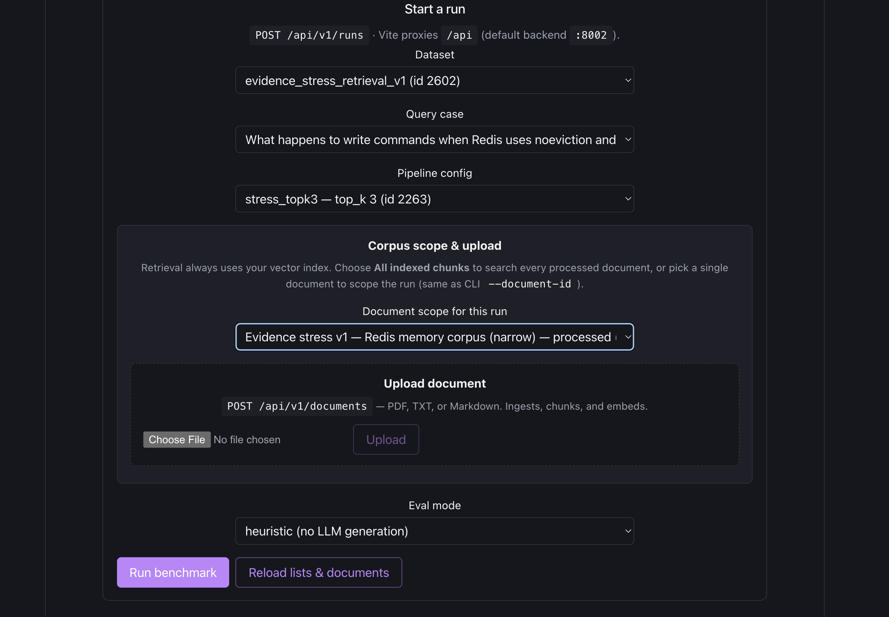
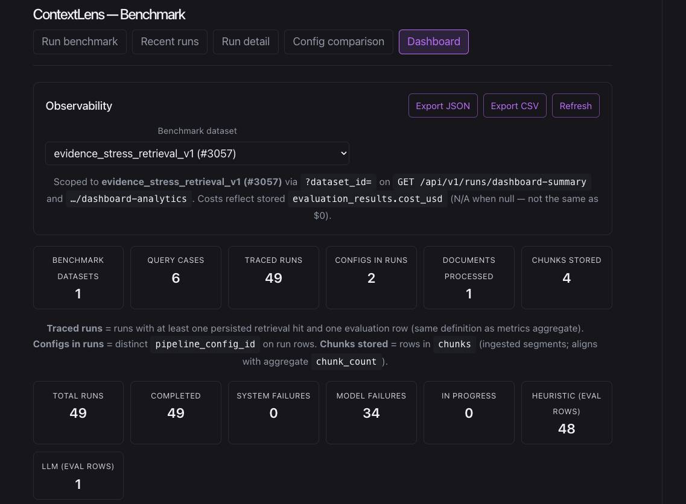
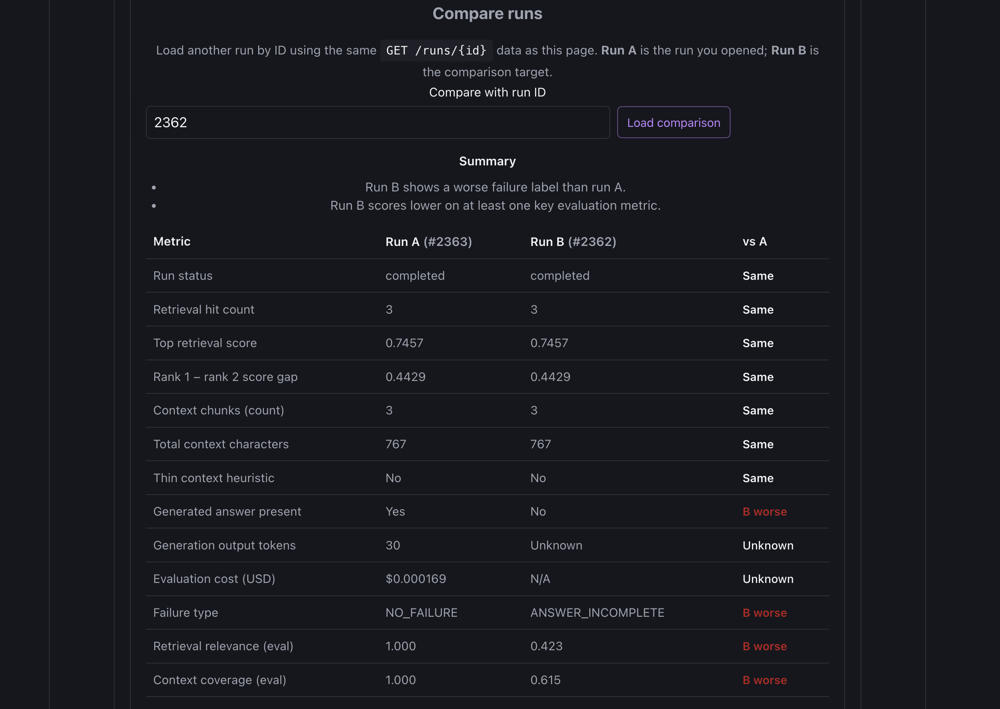

# ContextLens — RAG Evaluation and Debugging Platform

> **ContextLens helps developers understand *why* a RAG system failed, not just that it failed.**

Most retrieval-augmented generation projects stop at "upload a PDF and ask a question." ContextLens goes further: it instruments every stage of the pipeline, stores the full trace, evaluates output quality with a structured taxonomy, and gives you the tools to diagnose, compare, and iterate — without guessing.

---

## The Problem

RAG systems fail silently and in multiple ways. When a system returns a wrong or incomplete answer, the cause could be:

- **Retrieval miss** — the relevant passage was never retrieved
- **Chunk fragmentation** — the answer is split across chunks that don't connect
- **Context truncation** — relevant content was cut before reaching the model
- **Unsupported generation** — the model invented content not present in context
- **Incomplete answer** — context was present but the model missed part of it

Without instrumentation, debugging requires manually inspecting retrieval logs, re-running queries under different configs, and relying on intuition. That process doesn't scale across datasets, pipeline configurations, or teams.

---

## The Solution

ContextLens captures a **complete, structured trace** for every benchmark run and provides four layers of analysis:

| Layer | What it gives you |
|-------|-------------------|
| **Trace capture** | Query, config, retrieved chunks, generated answer, latencies, tokens, cost — persisted per run |
| **Evaluation** | Heuristic scoring (fast, offline) or LLM-as-judge (faithfulness, completeness, groundedness) |
| **Diagnosis** | Deterministic, explainable failure summaries — no extra LLM calls |
| **Comparison** | Side-by-side run diff and aggregate config comparison across benchmark datasets |
| **Observability** | Dashboard with time series trends, latency distributions, failure breakdowns, and config insights |

---

## Key Features

### Run Detail & Diagnosis
- **Diagnosis summary** — identifies the most likely failure cause from retrieval + context + evaluation signals
- **Phase timeline** — proportional bars showing where time was spent (retrieval / generation / evaluation), with dominant-phase callout
- **Retrieval inspection** — per-chunk scores, ranks, and source document labels for immediate provenance
- **Context quality analysis** — detects thin chunks, prefix overlap between consecutive hits, and single-document concentration
- **Generation & judge insights** — token usage, model, cost estimate, and LLM judge parse-quality badges
- **Run diff** — enter any second run ID to get a per-metric comparison table with `improved` / `worse` / `same` verdicts

### Evaluation Engine
- **Heuristic mode** — retrieval relevance and context coverage, fully offline, no API key required
- **LLM judge mode** — faithfulness, completeness, groundedness via OpenAI (default) or Anthropic; includes automatic retry on parse failure and structured observability metadata
- **9-type failure taxonomy** — `NO_FAILURE`, `RETRIEVAL_MISS`, `RETRIEVAL_PARTIAL`, `CHUNK_FRAGMENTATION`, `CONTEXT_TRUNCATION`, `ANSWER_UNSUPPORTED`, `ANSWER_INCOMPLETE`, `MIXED_FAILURE`, `UNKNOWN`
- **Cost tracking** — generation + judge estimates with explicit `NULL` semantics (never a fake zero)

### Runs List & Queue Browser
- **Search and filter** — server-side filters by status, evaluator type, dataset, and pipeline config; labeled client-side narrowing on loaded rows
- **Queue browser** (`/queue`) — merged view of pending/running/failed runs with on-demand queue-status inspection and one-click requeue for eligible full runs

### Dashboard
- **90-day trend chart** — daily run counts stacked by status (completed / failed / other)
- **Latency distribution** — min, avg, median, p95, max per pipeline phase
- **Failure breakdown** — overall failure counts and per-config breakdown with recent failed runs
- **Config insights** — per-pipeline aggregate scores, cost, top failure type, attention flags for failure-prone configs

### Infrastructure
- **Durable full-mode pipeline** — full RAG runs (generation + LLM judge) enqueued via Redis + RQ; survive API restarts; stale-lock reconciliation; one-click requeue
- **Benchmark registry** — full CRUD for datasets, query cases, and pipeline configs from the UI
- **Document upload** — PDF, TXT, Markdown via the Run tab; parsed, chunked, embedded, and stored in one request

---

## Architecture

```
┌─────────────────────────────────────────────────────────────┐
│              React + Vite + TypeScript (SPA)                │
│  /benchmark  /runs  /runs/:runId  /compare  /dashboard      │
│  /queue                                                      │
└─────────────────────┬───────────────────────────────────────┘
                      │  Vite proxy  /api → :8002
┌─────────────────────▼───────────────────────────────────────┐
│                 FastAPI  (async, Python)                     │
│  POST /runs        GET /runs         GET /runs/:id           │
│  GET /dashboard-analytics            GET /queue-status       │
│  POST /requeue     Registry CRUD     GET /config-comparison  │
└──────┬──────────────────┬───────────────────────┬───────────┘
       │                  │                        │
┌──────▼──────┐  ┌────────▼────────┐  ┌───────────▼──────────┐
│ PostgreSQL  │  │   Redis + RQ    │  │  OpenAI / Anthropic  │
│ + pgvector  │  │  (full runs)    │  │  (gen + LLM judge)   │
│  HNSW idx   │  │  Worker proc.   │  │                      │
└─────────────┘  └─────────────────┘  └──────────────────────┘
```

**Ingest path:**
```
Upload → Parse → Fixed/Recursive Chunk → Embed (MiniLM 384-dim) → pgvector
```

**Benchmark path — heuristic:**
```
Query × Config → Retrieve top-k → Heuristic eval → Trace stored → completed
```

**Benchmark path — full RAG:**
```
Query × Config → Retrieve → LLM Generate → LLM Judge → Trace stored → completed
                              (enqueued via RQ; durable across API restarts)
```

**Client-side diagnosis layer** is an intentional architectural decision: the diagnosis, diff, timeline, and source-label features are deterministic TypeScript logic over the existing `GET /runs/{id}` payload. No new backend contracts were needed — the trace is already complete.

---

## Tech Stack

### Backend
- **FastAPI** — async HTTP layer, typed route handlers
- **SQLAlchemy** (async) — ORM + query layer
- **Alembic** — sole source of DB schema (no `create_all` in production)
- **psycopg** — sync adapter used in RQ failure callbacks to avoid event-loop conflicts

### Frontend
- **React 18** + **TypeScript** — component-based SPA
- **Vite** — dev server with `/api` proxy; `vite preview` used for E2E tests
- **React Router DOM** — `BrowserRouter`; URL is source of truth for all view state
- **CSS component tokens** — lightweight, no charting library dependency

### Database / Infrastructure
- **PostgreSQL 16** + **pgvector** — vector storage with HNSW cosine index
- **Redis** + **RQ** — durable job queue for full-mode benchmark runs
- **Docker Compose** — single command starts `db`, `redis`, `backend`, `worker`

### AI / Evaluation
- **sentence-transformers** (`all-MiniLM-L6-v2`, 384-dim, L2-normalized) — local embeddings, no API key required
- **OpenAI** (default) — generation via Responses API; LLM judge via Chat Completions + JSON mode
- **Anthropic** (optional) — set `LLM_PROVIDER=anthropic` and `CLAUDE_API_KEY`

### Testing
- **pytest** — 141 backend tests; deterministic fake embeddings in `conftest.py` for fully offline CI
- **Vitest + React Testing Library** — 190 frontend unit/integration tests
- **Playwright** — 14 E2E tests using `page.route()` API mocking; no backend required to run

---

## Local Setup

### Prerequisites
- Docker and Docker Compose
- Node.js 18+
- Python 3.11+

### 1. Clone

```bash
git clone https://github.com/your-username/contextlens.git
cd contextlens
```

### 2. Configure environment

```bash
cp .env.example .env
# Edit .env and set:
#   DATABASE_URL
#   OPENAI_API_KEY     (required for eval_mode=full; not needed for heuristic)
#   LLM_PROVIDER=openai  (default; set to 'anthropic' + CLAUDE_API_KEY to use Anthropic)
```

### 3. Start infrastructure

```bash
# Start everything: db, redis, backend API, and RQ worker
docker compose up --build -d

# Run migrations
docker compose exec backend alembic upgrade head
```

> **Note:** `backend` and `worker` share the same image. `docker compose up --build` builds once and updates both. After changing `pyproject.toml`, rebuild with `docker compose build --no-cache`.

### 4. Seed benchmark data

```bash
docker compose exec backend python scripts/seed_benchmark.py
docker compose exec backend python scripts/run_benchmark.py --eval-mode heuristic
```

For full RAG runs (LLM generation + judge):

```bash
docker compose exec backend python scripts/run_benchmark.py --eval-mode full
```

### 5. Frontend

```bash
cd frontend
npm install
npm run dev
# Open http://localhost:5173
```

Vite proxies `/api` → `http://127.0.0.1:8002`. Override in `frontend/.env.development.local` if your API is on a different port (see `frontend/.env.example`).

### 6. Optional: local backend (without Docker)

```bash
cd backend
python -m venv .venv && source .venv/bin/activate
pip install -e ".[dev]"
alembic upgrade head
uvicorn app.main:app --reload --port 8002
```

> Use **one** backend at a time — either local uvicorn **or** Docker Compose backend, not both on port 8002.

---

## Example Workflow

1. **Upload a document** — drag a PDF, TXT, or Markdown file into the Run tab. The backend parses, chunks, embeds, and stores it in one request.

2. **Create registry entries** — add a dataset, write a query case (with optional reference answer), and define a pipeline config (chunking strategy, top-k, embedding model).

3. **Execute a benchmark run** — pick dataset → query case → pipeline config → click **Run**. Heuristic mode completes inline. Full mode enqueues to Redis and the UI polls for progress.

4. **Inspect the dashboard** — navigate to `/dashboard` to see 90-day run trends, latency distributions by phase, failure type breakdowns, and per-config score summaries.

5. **Open a run** — click any row in the Recent Runs list or navigate directly to `/runs/42`. The run detail view loads the full trace.

6. **Read the diagnosis** — the Diagnosis Summary identifies the most likely failure cause. The Phase Timeline shows where time was spent. Retrieval Hits show each chunk with its source document label and score.

7. **Compare runs** — in the Run Diff panel, enter a second run ID and click **Load comparison** to see a per-metric table with improvement verdicts. Useful for comparing two pipeline configs on the same query.

8. **Check the queue** — navigate to `/queue` to see all pending, running, and failed full-mode runs. Click **Queue status** on any row for Redis lock and RQ job state. Use **Requeue** if a run is stuck after a worker failure.

---

## Screenshots

### 1. Run Workflow Entry

The benchmark entry point: pick a dataset, query case, and pipeline config. Document upload and corpus scope are handled in the same panel.



---

### 2. Dashboard Overview

90-day run trends, per-phase latency distributions, failure type breakdown, and per-config insights — all from a single parallel API fetch.



---

### 3. Run Diagnosis — Hero View

The core debugging surface: phase timeline with proportional bars and dominant-phase callout, diagnosis summary with failure type and supporting evidence, and retrieval inspection with source labels.


---

### 4. Retrieval Source Inspection

Every retrieved chunk shows its rank, cosine similarity score, source document label, and text preview. A diversity note flags when all hits originate from the same document.


---

### 5. Run Diff

Enter any second run ID to get a side-by-side comparison across retrieval, context, generation, cost, and evaluation metrics — each row labeled `improved`, `worse`, or `same`.



---

### 6. Runs List with Filters

Server-side filters (status, evaluator type, dataset, pipeline config) combined with labeled client-side row narrowing. Every row links directly to the run detail view.


---

### 7. Test Suite

141 backend pytest tests, 190 frontend Vitest tests, 14 Playwright E2E tests — all green. Backend tests run fully offline using deterministic fake embeddings. E2E tests use `page.route()` API mocking with no backend dependency.


---

## Why This Project Is Different

**This is not a chatbot wrapper.** There is no public "ask a question, get an answer" endpoint. The generation path exists exclusively on the benchmark/evaluation pipeline to support systematic experimentation and measurement.

| Common RAG demo | ContextLens |
|-----------------|-------------|
| Upload PDF → ask question → done | Full trace stored per run: chunks, scores, answer, latencies, cost |
| No failure analysis | 9-type failure taxonomy applied and persisted on every run |
| Debugging by eyeballing | Deterministic diagnosis heuristics with explicit, readable output |
| One config tested | Benchmark across configs; aggregate comparison with per-evaluator bucketing |
| No operational visibility | Dashboard: 90-day trends, p95 latencies, per-config failure rates |
| Evaluation = "looks right" | Dual-mode scoring with N/A vs zero semantics; no blended averages across evaluator types |
| No test infrastructure | 345 automated tests across three layers with offline-capable fixtures |

The diagnosis layer is intentionally client-side: deterministic TypeScript logic over the existing run trace. No additional LLM calls, no new API contracts, fully testable in isolation.

---

## Testing and Quality

### Backend — 141 pytest tests

```bash
cd backend && pytest
```

Covers: document ingestion, retrieval, full RAG pipeline, heuristic + LLM judge evaluation, failure taxonomy normalization, run lifecycle, requeue, queue-status, dashboard summary, dashboard analytics, config comparison, registry CRUD, cost estimation, stale-lock reconciliation, and LLM judge parse retry with golden fixtures.

**Runs fully offline.** `backend/tests/conftest.py` replaces the `sentence-transformers` model with deterministic 384-dim L2-normalized fake vectors — no model download required for CI.

### Frontend — 190 Vitest tests

```bash
cd frontend && npm run test
```

Covers: run diagnosis heuristics (`runDiagnosis.ts`), run diff (`runDiff.ts`), phase timeline (`runTimeline.ts`), retrieval source formatting (`retrievalSourceFormat.ts`), dashboard analytics format helpers (`dashboardAnalyticsFormat.ts`), runs list query logic (`runsListQuery.ts`), queue browser load (`queueBrowserLoad.ts`), all panel components via RTL, and all route paths via the router.

### E2E — 14 Playwright tests

```bash
cd frontend
npx playwright install   # required once; downloads Chromium browser binary
npx playwright test
```

Tests span `e2e/run-detail.spec.ts` (11), `e2e/runs-list.spec.ts` (1), `e2e/queue-browser.spec.ts` (1), and `e2e/dashboard.spec.ts` (1). All use `page.route()` to intercept API calls with deterministic fixtures — **no backend required**.

> **Note:** Browser binaries are not bundled in the repository. Run `npx playwright install` once before the first E2E run on a new machine.

---

## Future Work

- **Auth and multi-user** — login, team workspaces, API key management
- **Hybrid retrieval** — BM25 + vector fusion, reranking layer
- **Export and reporting** — downloadable run traces, Slack/webhook alerts on failure spikes
- **Production deploy** — nginx SPA fallback config, managed PostgreSQL, CDN for frontend assets
- **Richer diff UI** — generated answer text side-by-side, highlighted token-level differences
- **Full RQ job browser** — bulk queue operations, job-level retry controls

---

## Documentation

| Document | Contents |
|----------|----------|
| `docs/BENCHMARK_WORKFLOW.md` | End-to-end seed → run → metrics workflow |
| `docs/DEV_FULL_RUN_QUEUE.md` | Full-mode RQ operations, restart semantics, validation log |
| `docs/FULL_RAG_EXAMPLE.md` | Full RAG run with generation + LLM judge |
| `docs/METRICS_INSTRUMENTATION.md` | Metric semantics, evaluator bucketing, N/A vs zero |
| `docs/DEPLOYMENT.md` | Vercel + Render runbook (`render.yaml`), env map, migrations, smoke checklist |
| `PROJECT.md` | Architecture, API surface, data model, phase roadmap |
| `DECISIONS.md` | Engineering constraints and design rationale |
| `CURRENT_STATE.md` | Verified implementation state per phase |

---

## License

MIT. See [LICENSE](LICENSE).
